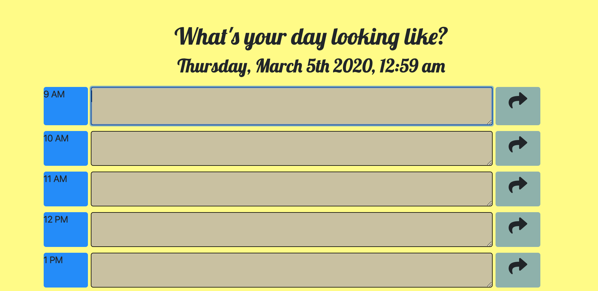
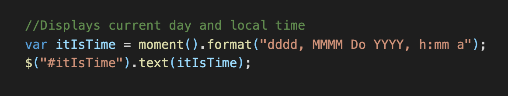
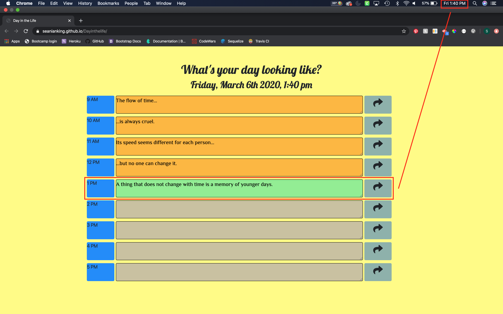
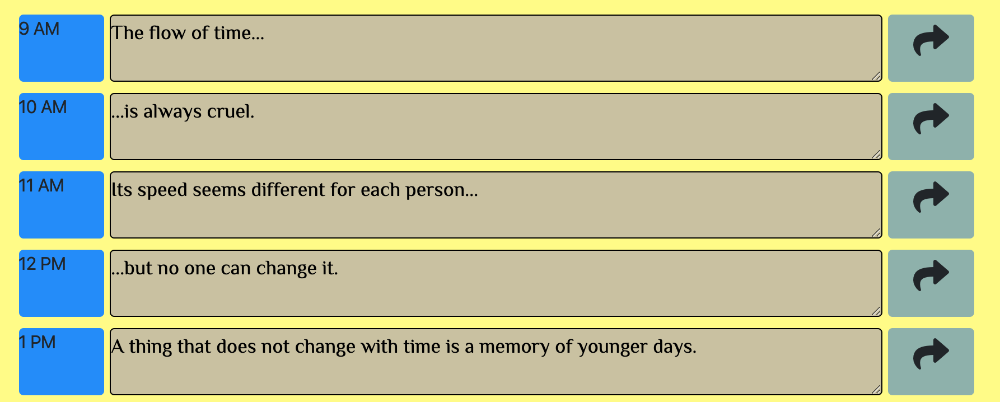
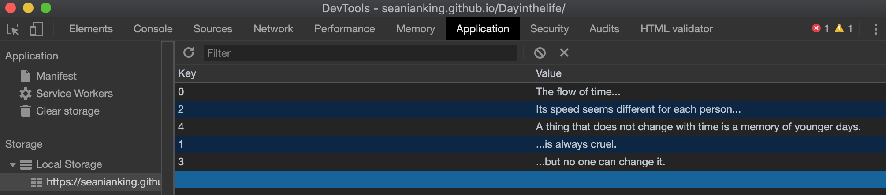

# Day in the life Planner

### Link to the deployed site

https://seanianking.github.io/Dayinthelife/

## Contents

Below is a picture of the landing page:

Using moment.js the date and time is displayed at the top of the planner section.

Incorporating both moment.js and JQuery together, previous hours will have an orange background color, the current hour will have green, and upcoming hours will have a brown display.

When pressing the button to the right of the text area, it saves the text to local storage.

